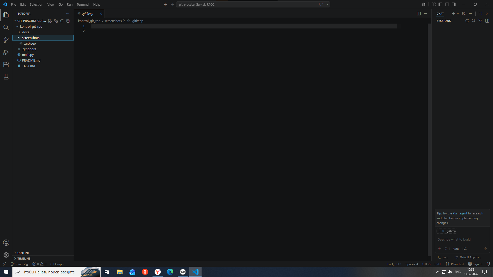
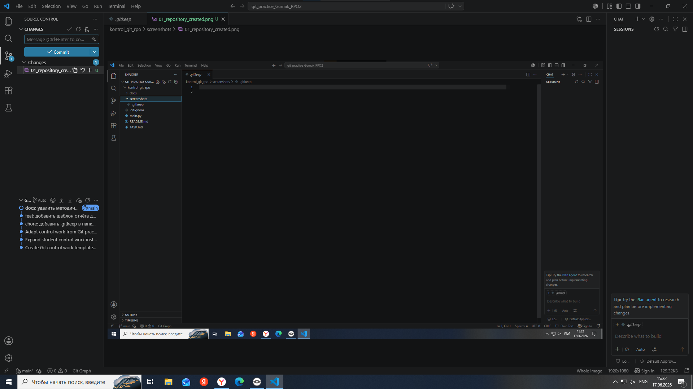
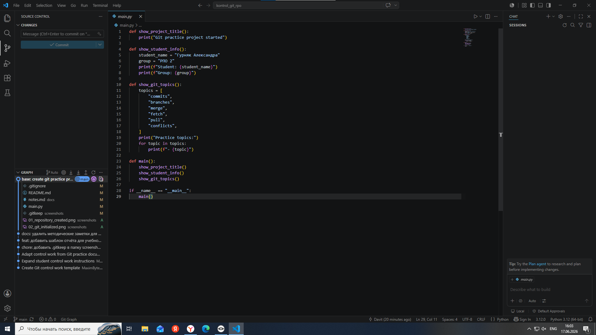
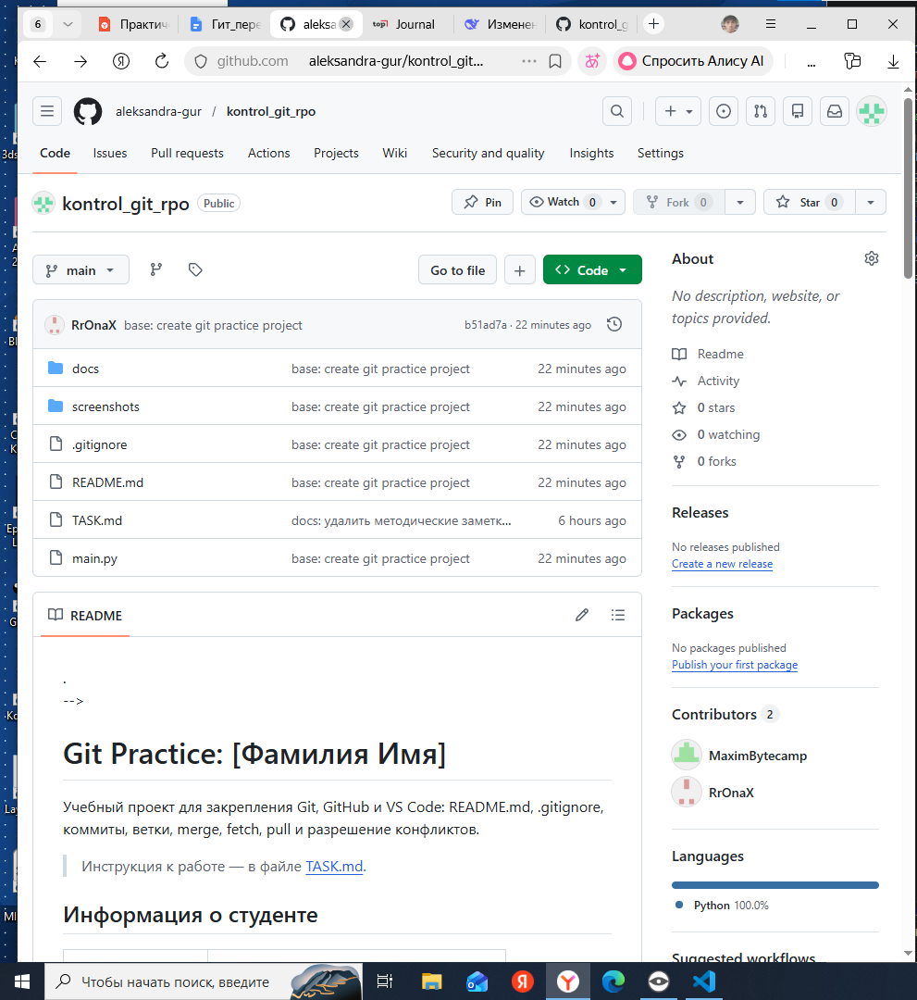
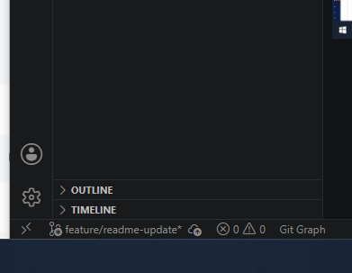
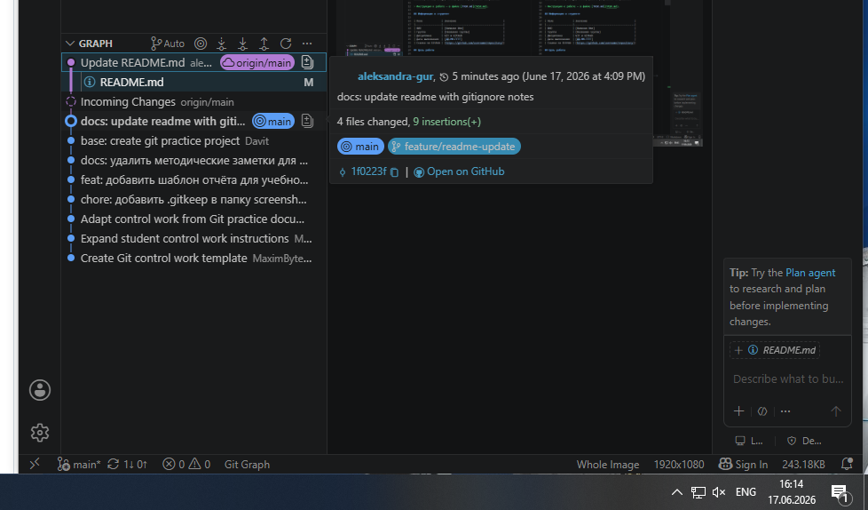
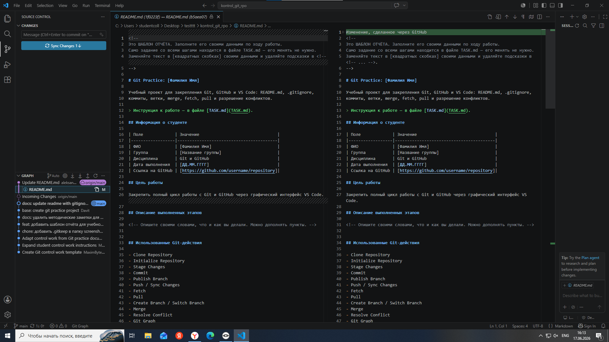
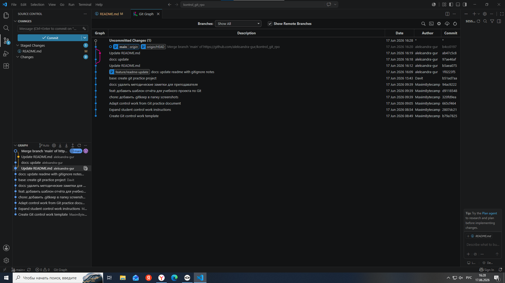

Изменение, сделанное через GitHub

# Git Practice: [Гурняк Александра]

Учебный проект для закрепления Git, GitHub и VS Code: README.md, .gitignore,
коммиты, ветки, merge, fetch, pull и разрешение конфликтов.

> Инструкция к работе — в файле [TASK.md](TASK.md).

## Информация о студенте

| Поле             | Значение                                |
|------------------|-----------------------------------------|
| ФИО              | [Гурняк Александра]                           |
| Группа           | [РПО 2]                       |
| Дисциплина       | Git и GitHub                            |
| Дата выполнения  | [17.06.2026]                            |
| Ссылка на GitHub | [https://github.com/aleksandra-gur/kontrol_git_rpo]|

## Цель работы

Закрепить полный цикл работы с Git и GitHub через графический интерфейс VS Code.

## Описание выполненных этапов

Я создала папку git_practice_Фамилия_Группа, открыла её в VS Code и инициализировала Git-репозиторий через Source Control. Создала папки docs, screenshots, файлы main.py, README.md, .gitignore, docs/notes.md. Настроила .gitignore, чтобы в репозиторий не попадали временные и служебные файлы.

Сделала первый коммит с сообщением base: create git practice project, опубликовала репозиторий на GitHub. Создала ветку feature/readme-update, в которой добавила в README.md раздел про .gitignore, и сделала коммит.

Переключилась на main, выполнила слияние ветки через Merge Branch. На GitHub изменила README.md, затем в VS Code выполнила Fetch (посмотрела изменения) и Pull (применила их локально).

Специально создала конфликт, изменив одну строку локально и на GitHub, разрешила его вручную, закоммитила с сообщением fix: resolve pull conflict in readme. Оформила README.md, добавила скриншоты и ссылку на репозиторий.

Самым сложным было разрешение конфликта, но я разобралась. В итоге создан репозиторий с историей коммитов, отработаны ветки, слияние, Fetch, Pull и конфликты.

## Использованные Git-действия

- Clone Repository
- Initialize Repository
- Stage Changes
- Commit
- Publish Branch
- Push / Sync Changes
- Fetch
- Pull
- Create Branch / Switch Branch
- Merge
- Resolve Conflict
- Git Graph

## Таблица Git-действий и их смысла

| Действие              | Где в VS Code                     | Смысл                                                   |
|-----------------------|-----------------------------------|---------------------------------------------------------|
| Clone Repository      | Command Palette → `Git: Clone`    | Копирует репозиторий с GitHub на компьютер              |
| Initialize Repository | Source Control                    | Создаёт локальный Git-репозиторий                       |
| Stage Changes         | Source Control, кнопка `+`         | Подготавливает файлы к коммиту                          |
| Commit                | Поле `Message` + кнопка `Commit`  | Сохраняет версию проекта в истории                      |
| Publish Branch        | Source Control                    | Публикует проект/ветку на GitHub                        |
| Push / Sync Changes   | Source Control                    | Отправляет и синхронизирует коммиты с GitHub            |
| Fetch                 | Source Control → `...` → `Fetch`  | Проверяет изменения на GitHub, не меняя локальные файлы |
| Pull                  | Source Control → `...` → `Pull`   | Загружает и применяет изменения с GitHub                |
| Create / Switch Branch| Панель снизу слева, Git Graph     | Создаёт и переключает ветки                             |
| Merge                 | Git Graph / Command Palette       | Объединяет изменения одной ветки с другой               |
| Resolve Conflict      | Редактор VS Code                  | Выбор или объединение конфликтующих изменений           |
| Git Graph             | Расширение Git Graph              | Показывает историю коммитов и веток                     |

## Разница между Fetch и Pull

Я проверила разницу на практике. Сначала я изменила файл README.md через сайт GitHub и сделала там коммит. Потом в VS Code я нажала Fetch — изменения скачались, но в самом файле я их не увидела, они просто появились в списке входящих изменений. Только после того, как я нажала Pull, изменения применились к моему локальному файлу, и я увидела новый текст.

## Конфликт и его решение

Я создала конфликт специально. Сначала я изменила одну строку в README.md на своём компьютере и сделала коммит. Затем на GitHub я изменила эту же строку по-другому и тоже сделала коммит. Когда я попыталась сделать Pull, VS Code показала конфликт — в файле появились маркеры <<<<<<< HEAD и >>>>>>>.

Я решила конфликт вручную: удалила маркеры, выбрала подходящий вариант текста (или объединила оба), сохранила файл. Затем добавила его в Stage, сделала коммит с сообщением fix: resolve pull conflict in readme и отправила изменения на GitHub.

## Скриншоты выполнения работы

### 1. Созданный проект в VS Code

### 2. Инициализированный репозиторий

### 3. Первый коммит

### 4. Репозиторий на GitHub

### 5. Созданная ветка

### 6. Результат merge

### 7. Выполнение Fetch / Pull

### 8. Итоговая история в Git Graph

## Вывод

В ходе работы я научилась создавать и публиковать Git-репозиторий, работать с ветками, выполнять слияние и разрешать конфликты. Самым сложным оказалось разрешение конфликта вручную, но я разобралась, как это делать. Закрепила на практике разницу между Fetch и Pull, поняла, почему важно проверять изменения перед отправкой и всегда делать Pull перед началом работы.

## Что я поняла про .gitignore

- `.gitignore` помогает не отправлять в GitHub временные и секретные файлы.
- Файл `.env` нельзя публиковать, потому что в нём могут быть токены и пароли.
- Логи `*.log` обычно не нужны в репозитории.
- Папки `venv/` и `.venv/` не добавляют в Git, потому что их можно создать заново.
- Перед коммитом нужно проверять Source Control.
